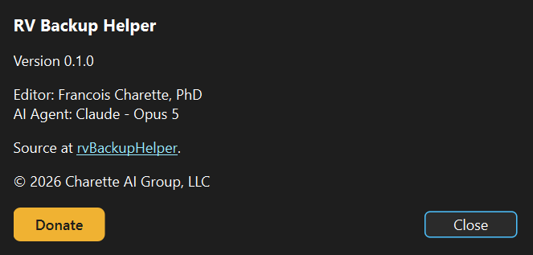

# RV Backup Helper — user manual

RV Backup Helper puts distance markings on the rear-view camera of an RV whose
factory display draws none. You measure the real world once, behind the vehicle,
and the application turns those measurements into an Arduino sketch that
overlays them on the live camera picture.

The work is a chain, and each link is a page here. Read them in order the first
time; afterwards you will mostly return to one.

| # | Page | What it covers |
|---|---|---|
| 1 | [Hardware setup](hardware-setup.md) | The rig, the shield's two switches, the toolchain |
| 2 | [Capturing footage](capturing-footage.md) | Recording behind the RV, cleanly |
| 3 | [Calibrating](calibrating.md) | Turning footage into measurements and a JSON file |
| 4 | [Sketch and upload](sketch-and-upload.md) | Generating the sketch and flashing it |

## The workflow at a glance

```
      behind the RV                 at a desk                    on the bench
 ┌───────────────────────┐   ┌───────────────────────┐   ┌───────────────────────┐
 │ 1. lay a marked pole  │   │ 3. open the clip      │   │ 5. Generate Arduino   │
 │    at each distance   │──▶│    click each marker  │──▶│    Sketch...          │
 │ 2. record it, with    │   │ 4. Save... the JSON   │   │ 6. Upload to Arduino  │
 │    the grid turned off│   │                       │   │                       │
 └───────────────────────┘   └───────────────────────┘   └───────────────────────┘
        a .avi clip              a calibration .json           a flashed board
```

Three artefacts come out of it, and they are not equal:

* **The clip** is large, disposable, and git-ignored. Record it again whenever
  you like.
* **The calibration JSON** is small, precious, and version controlled. It is the
  only thing here that cannot be reproduced without another trip to the RV.
* **The sketch** is generated. Regenerating it from the JSON takes one click, so
  never hand-edit it.

## What the result looks like

The overlay buffer the shield draws, rendered from the tables in a generated
sketch:


Horizontal lines mark measured distances, each label sitting *in* its own line
so there is no doubt which belongs to which. The dashed pair is the width of the
RV, drawn through the points you measured. The 1 ft line is heavier — it is the
"about to touch something" line.

It is monochrome white, and that is a hardware limit rather than a choice: the
overlay is one bit per pixel, and NTSC colour would need a subcarrier the
microcontroller cannot generate while it is also locking to the camera.

## Reaching this manual from the application

**Help → User Manual…**, or **F1**, opens these pages. It prefers the copy in
your own checkout — no network, no GitHub sign-in — and falls back to the
rendered copy on GitHub for an install that carries no docs, or if nothing on
the system is willing to open a `.md` file.

A markdown viewer is worth having for the local copy; without one the file
opens in whatever editor is associated with `.md`, and the screenshots will not
be drawn inline.

## Help, and supporting the work

**Help → About** carries the version, the credits and a Donate button. The
project is free; the button is there for anyone who finds it useful and would
like to say so.



## Conventions in these pages

> **Trap.** Boxes like this mark the things that make you think the equipment is
> broken when it is not. Every one of them cost someone an hour.
