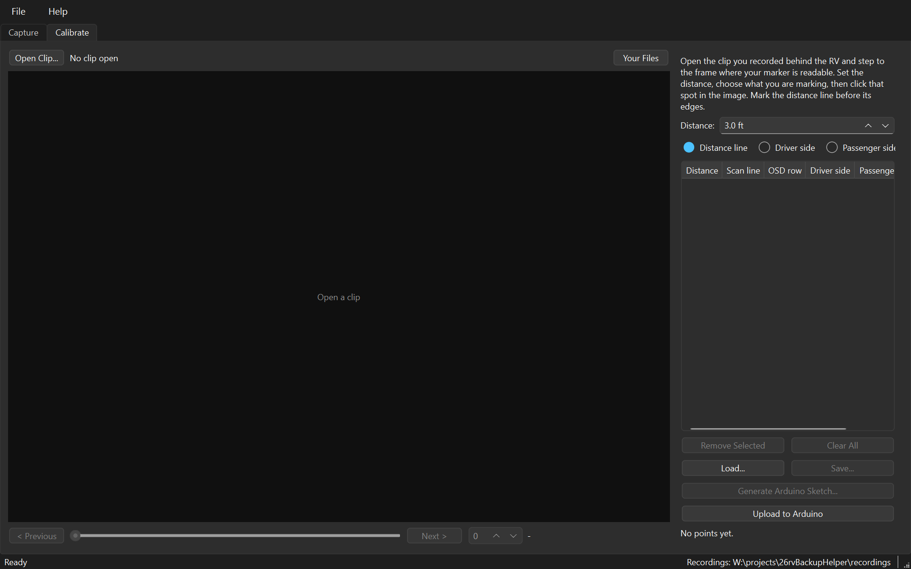
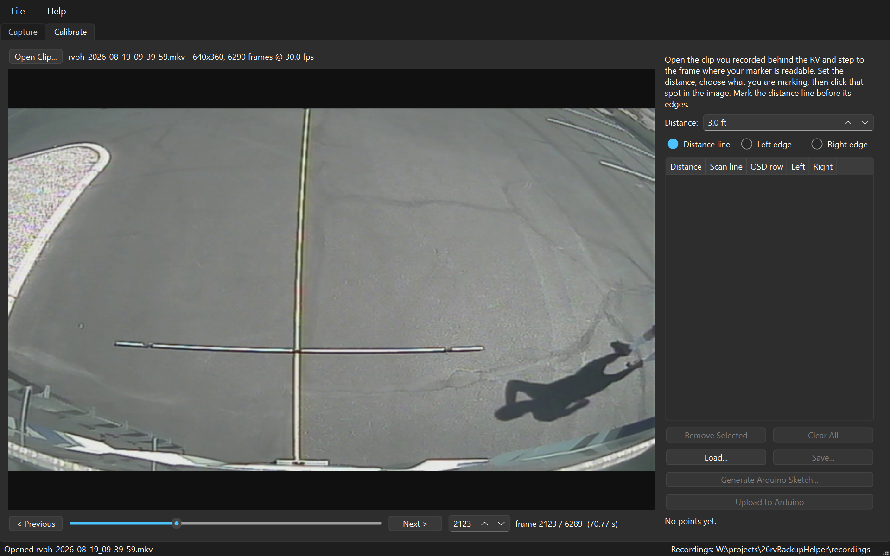

# 3. Calibrating

[← Capturing footage](capturing-footage.md) · [Manual index](README.md) · [Next: Sketch and upload →](sketch-and-upload.md)

Calibration is where a recording becomes measurements. You find the frame where
a marker is readable, tell the application how far away it is, and click it. The
result is a small JSON file that everything downstream is generated from.

**Contents**

* [What a calibration actually is](#what-a-calibration-actually-is)
* [A tour of the Calibrate tab](#a-tour-of-the-calibrate-tab)
* [Marking distances](#marking-distances)
* [Marking the vehicle width](#marking-the-vehicle-width)
* [Reading the table](#reading-the-table)
* [Saving](#saving)
* [Checking your work](#checking-your-work)
* [Tips and traps](#tips-and-traps)

---

## What a calibration actually is

A short list of correspondences between the real world and the picture:

> at **4 ft** behind the bumper, the ground appears on **scan line 241**, and the
> RV is as wide as the picture from **column 437** to **column 138**

Nothing more. The application turns that into rows on the shield's 136×96 canvas
by simple proportion, which is why the frame's height is stored alongside — a
scan line means nothing without knowing what height it was measured in.

## A tour of the Calibrate tab



The left is a clip browser: **Open Clip…**, the picture, and a transport with a
slider, a frame box and Previous/Next. **Your Files**, opposite Open Clip,
opens the folder holding your clips, calibrations and logs — the same one the
About box names, which in an installed build is under `AppData` where you
would not think to look. The right is the measurement panel.

Open the clip you recorded and step to a frame where the pole is readable.



The cursor becomes a crosshair over the picture, because clicking the picture is
how everything here is done.

## Marking distances

1. Set **Distance** to the value this pole position represents.
2. Leave the radio button on **Distance line**.
3. Click the pole in the picture.

An amber guide is drawn where you clicked, so you can see at once whether it
landed on the mark. Re-clicking the same distance replaces the earlier point
rather than stacking two guides — correcting a misplaced click is just clicking
again.

Then step to the frame for the next distance and repeat. **Each point remembers
its own frame**, because the pole is carried to a new distance for every shot.

## Marking the vehicle width

If your pole carries the RV's width marked on it, switch the radio button to
**Driver side** or **Passenger side** and click those markings. A green tick
shows where each landed.

> They name sides of the *vehicle*, not sides of the picture, because "left"
> answers differently depending on where you are standing. The buttons assume a
> **mirrored** camera — one whose picture reads like a rear-view mirror, which
> puts the driver's side on the left of the image. If yours is not mirrored the
> two are swapped, so settle it once before marking: stand at one rear corner
> and see which side of the picture you appear on.

**Mark the distance line before its edges** — an edge with no line has nothing
to attach to, and the application will say so rather than inventing a scan line
nobody measured.

Two distances with both edges are enough to draw a corridor. More is better: the
corridor is drawn as a polyline *through* your points, not as a straight taper,
because a wide-angle camera bends what is really a straight path into a curve
across the picture. Every extra distance makes the curve truer.


## Reading the table

| Column | Meaning |
|---|---|
| **Distance** | What you typed |
| **Scan line** | The row in the captured frame you clicked |
| **OSD row** | That row rescaled onto the shield's 96-row canvas — the number the sketch uses |
| **Left**, **Right** | The width edges, in frame columns; `-` until marked |

The summary underneath counts the points and how many have both edges, and warns
if two distances land on the same **OSD row**. That is worth heeding: the capture
is several times taller than the shield's canvas, so distances a few scan lines
apart collapse onto one row the hardware cannot draw apart.

## Saving

**Save…** writes the JSON. This file is **not** git-ignored, deliberately: it is
the one artefact here that cannot be reproduced without another trip to the RV.
Commit it.

```json
{
  "version": 1,
  "sourceClip": "2026-08-19_09-39-59.mkv",
  "frameWidth": 640,
  "frameHeight": 360,
  "points": [
    { "distanceFeet": 4.0, "scanLine": 241, "frameIndex": 2123,
      "overlayRow": 64, "leftEdge": 437, "overlayLeft": 93,
      "rightEdge": 138, "overlayRight": 29 }
  ]
}
```

`scanLine` with `frameHeight` is the source of truth; `overlayRow` and the
`overlay…` columns are written for readers who would rather not redo the
arithmetic.

## Checking your work

Real measurements are self-checking if you look at them, and two patterns catch
a misclick without needing the vehicle:

* **Width should taper smoothly** with distance, and the *rate* of narrowing
  should decrease. Perspective demands it.
* **The corridor's centre should drift smoothly, or not at all.** A steady drift
  means the camera sits slightly off the vehicle's axis, which is real. A *jump*
  means a misclick.

A sudden break in either sequence is the point to re-open and check.

## Tips and traps

**Maximise the window before marking.** Clicks resolve to about a scan line, and
the picture is scaled to fit — a bigger picture is a finer measurement.

> **Trap — opening a clip of a different frame size clears the points.** That is
> deliberate. Scan lines from a differently sized frame would quietly mean
> different distances, and silently mixing them would produce a calibration that
> looks fine and is wrong.

**A 0 ft point is allowed and useful.** Marking the bumper itself gives the
driver a line for "this is the vehicle", which makes every other line easier to
read.

**Which marker you call left and right does not matter to the drawing.** A
mirrored camera view puts the RV's left on the picture's right, so the recorded
"left" column may be the larger number. Both edges are drawn wherever they are.
