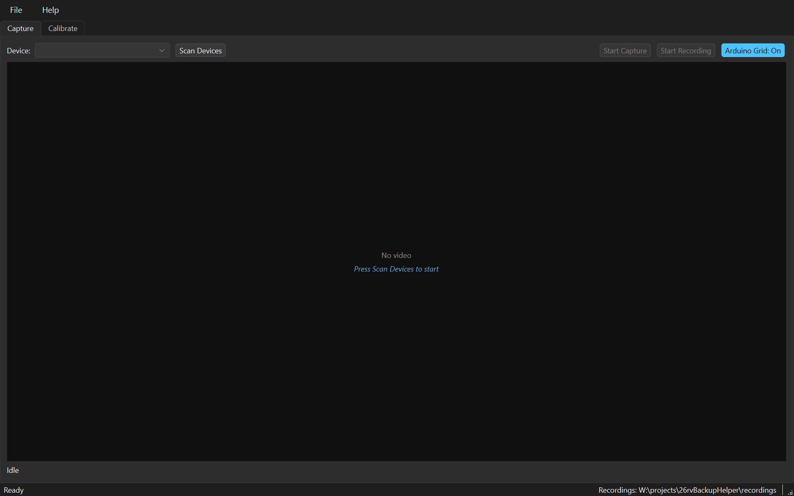
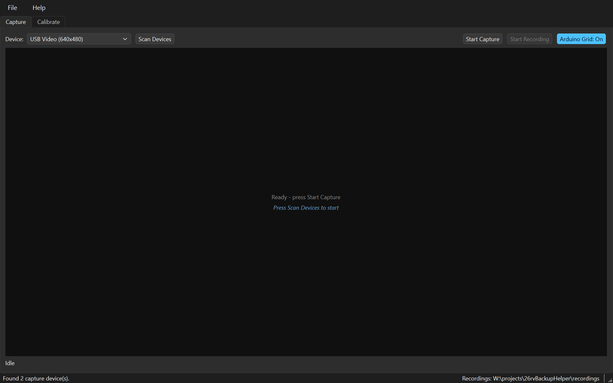
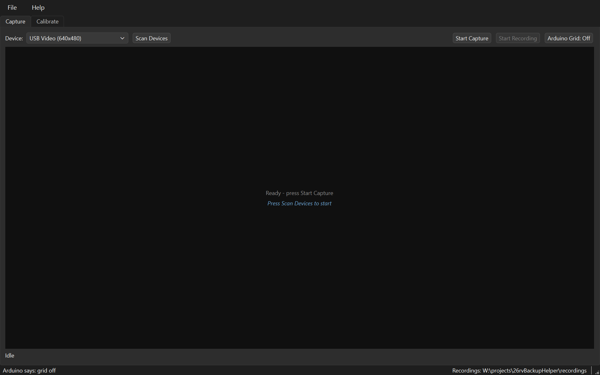

# 2. Capturing footage

[← Hardware setup](hardware-setup.md) · [Manual index](README.md) · [Next: Calibrating →](calibrating.md)

This is the part done at the vehicle, and the only part you cannot redo at a
desk. A calibration is only ever as good as the clip it was measured from, so
it is worth a few minutes of care.

**Contents**

* [What you are recording, and why](#what-you-are-recording-and-why)
* [A tour of the Capture tab](#a-tour-of-the-capture-tab)
* [Turn the grid off first](#turn-the-grid-off-first)
* [Recording](#recording)
* [Where clips go](#where-clips-go)
* [Tips and traps](#tips-and-traps)

---

## What you are recording, and why

You need a frame in which you can see, simultaneously, a marker on the ground
and know exactly how far away it is. The method that works is a **long pole laid
across the driveway**, carried to each distance in turn, with the RV's width
marked on it.

That gives two measurements per shot:

* **How far back** the pole is — read off the scan line it lies on.
* **How wide** the vehicle is at that distance — read off the two marks.

You will move the pole several times, so **every distance comes from its own
frame**. The application records which frame each measurement came from, so any
single point can be checked later.

Six or seven distances is enough for a usable grid; more gives a truer width
corridor, because the corridor is drawn through the points you measured rather
than assumed to taper in a straight line.

## A tour of the Capture tab



Press **Scan Devices**. The scan opens and closes each capture device in turn,
so it takes a few seconds; it runs off the interface thread, so the window stays
responsive.



Devices are listed by their Windows name, so the grabber is easy to tell from a
webcam. A device that opens but is not receiving video is listed as **no video**
rather than hidden — hover it to see why, which is either nothing connected or
another application holding it.

**Start Capture** gives a live preview. **Start Recording** writes a clip.

Starting capture on a device showing *no video* is fine and often correct: the
preview says "Waiting for video signal" and begins the moment video arrives,
which is exactly what an RV camera powered only in reverse gear needs.

## Turn the grid off first



**Arduino Grid: On / Off**, beside the recording controls, blanks the shield's
overlay so the camera passes through clean.

**Record calibration footage with it off.** A grid burned into the clip sits
directly on top of the pole markings you need to click afterwards — that mistake
cost a whole calibration session once, because the shield's own reference lines
were indistinguishable from the measuring marks.

It takes a couple of seconds, because opening a serial port resets the Arduino
and the board has to boot before it can answer. The state is kept in the
Arduino's own EEPROM, so it survives that reset, unplugging the board, and
closing the application.

> **Trap — the toggle needs the generated grid sketch on the board.** The
> bring-up diagnostic accepts no commands. If it is what is flashed, the button
> reports that the board did not answer rather than failing quietly.

## Recording

1. **Arduino Grid → Off**
2. **Scan Devices**, pick the grabber
3. **Start Capture**, confirm the rear view looks right
4. **Start Recording**
5. Lay the pole at each distance in turn, pausing a moment at each so there is a
   clean frame to find later
6. **Stop Recording**

A few seconds per distance is plenty. Clips are large — expect tens of megabytes
per minute.

## Where clips go

Clips are timestamped `.avi` files, MJPG encoded. MJPG compresses each frame on
its own, which means every frame decodes independently and stepping to an exact
frame is exact. That matters more here than file size: a calibration measures
one specific frame.

They are written to `recordings/` inside the project by default, which is
**git-ignored** so video never reaches GitHub. Change it with
**File → Recordings Folder…**; the choice persists between sessions and the
current location is always shown at the right-hand end of the status bar.

Pointing it outside the project is the safer habit, and on a laptop it lets
clips go straight to an external drive.

## Tips and traps

> **Trap — close OBS.** Only one application can hold a capture device at a
> time. With OBS running on the grabber, RV Backup Helper opens the device and
> receives nothing — while the video is plainly visible in OBS, which makes it
> look like the application is broken. It is not.

> **Trap — record at the camera's native 4:3 size.** Composite video is 4:3.
> Recording through a tool configured for a 16:9 canvas gives, say, 640×360, and
> the mapping you then measure will not match the full frame the shield actually
> draws on. Use the app's own Capture tab and this cannot happen; if you use
> something else, set its output to 640×480.

**Light matters more than you would expect.** Bright sun on concrete washes the
markings out. If the picture looks white and flat, check it before recording a
whole session — `tools/measureVideoLevels.py` reports the black floor and how
much of the picture is pinned at white:

```powershell
.venv\Scripts\python.exe tools\measureVideoLevels.py "recordings\*.avi"
```

Clipping is the reliable symptom of a signal riding too high, because it does
not depend on what is in shot. A high black floor on its own can simply mean a
bright scene.
